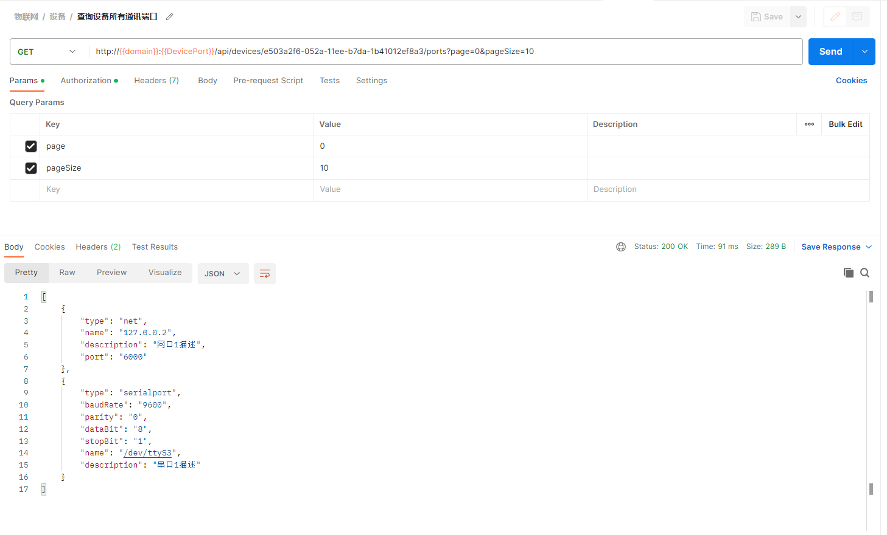
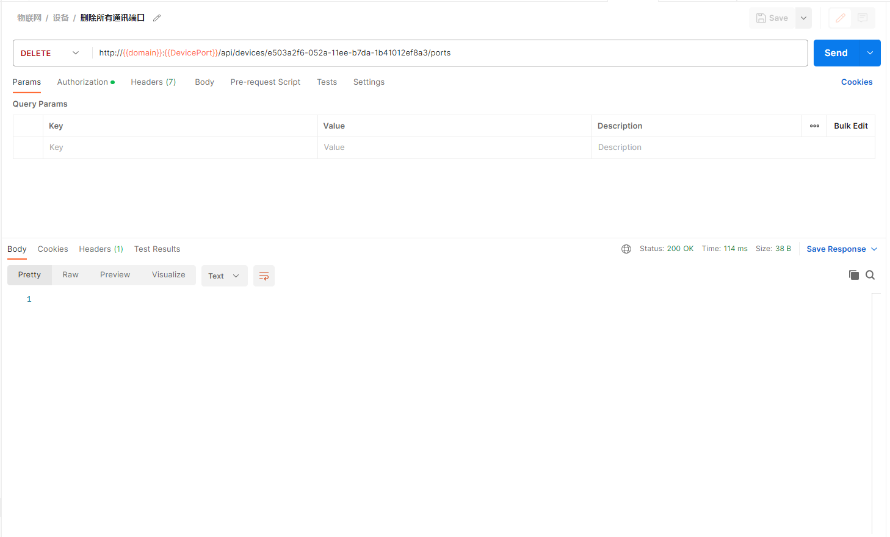
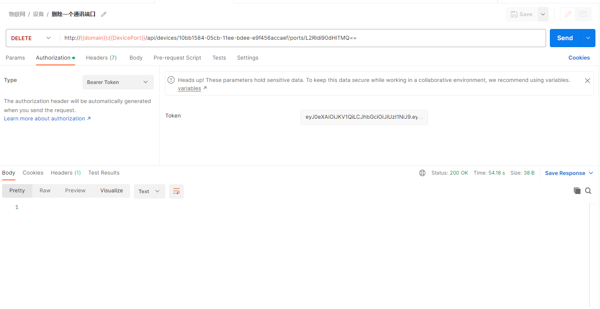
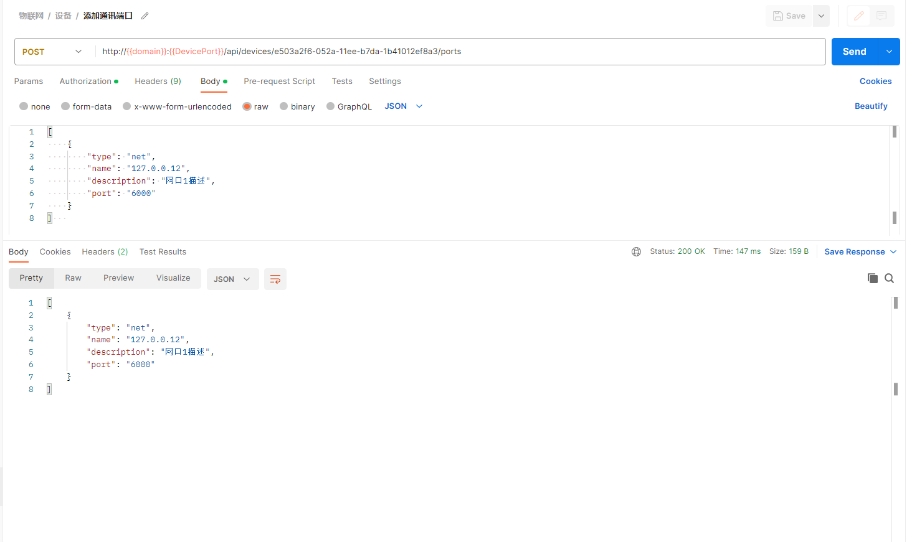
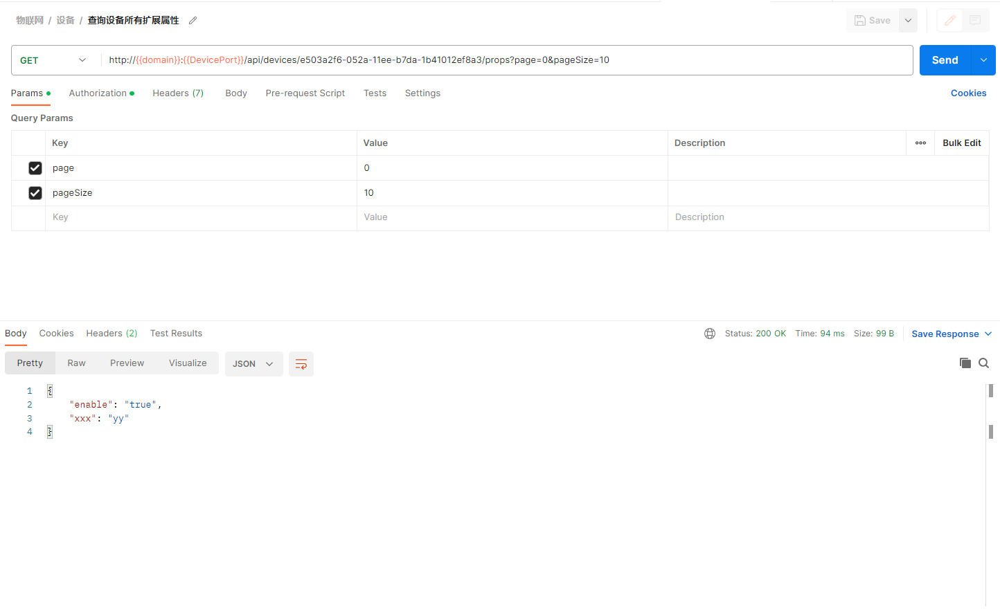
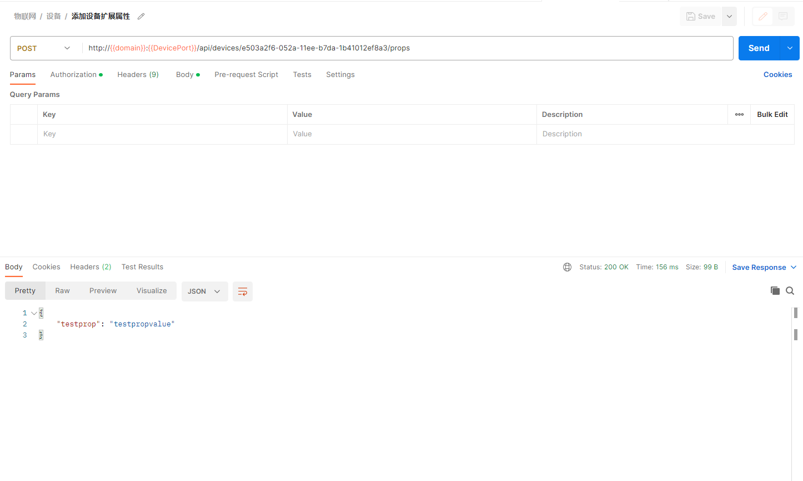
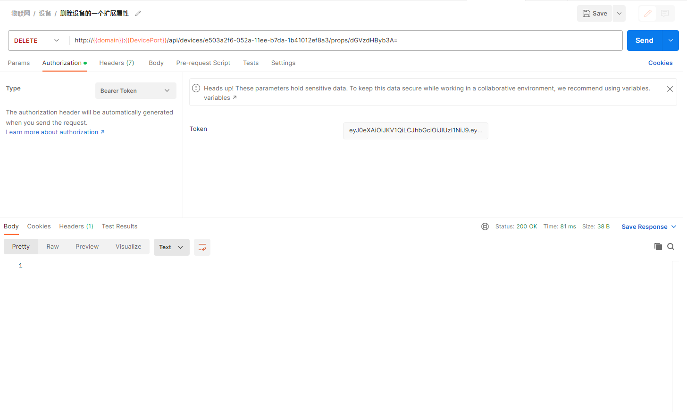
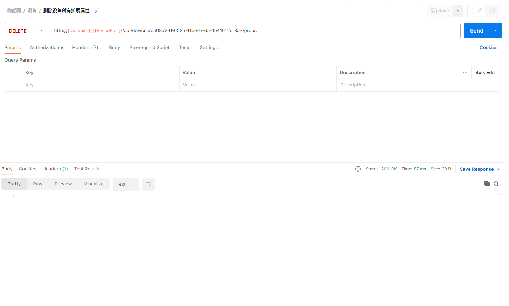

## 添加设备

- **参数列表**

    | 项目   | 内容                               | 描述              |
    |--------|------------------------------------|-------------------|
    | 服务器 | iot.lecsofts.com:8000              |                   |
    | 接口   | /api/organizations/{orgId}/devices |                   |
    | 方法   | POST                               |                   |
    | Token  | Bearer Token                       | 用户登录返回token |
    | 请求   | JSON                               | 参看下图          |
    | 响应   | JSON                               | 参看下图          |

  
- **postman操作**
  
    

## 删除设备

- **参数列表**

    | 项目   | 内容                                          | 描述              |
    |--------|-----------------------------------------------|-------------------|
    | 服务器 | iot.lecsofts.com:8000                         |                   |
    | 接口   | /api/organizations/{orgId}/devices/{deviceId} |                   |
    | 方法   | DELETE                                        |                   |
    | Token  | Bearer Token                                  | 用户登录返回token |
    | 请求   | 无                                            |                   |
    | 响应   | true                                          | 参看下图          |

  
- **postman操作**
  
    

## 更新设备

- **参数列表**

    | 项目   | 内容                                          | 描述              |
    |--------|-----------------------------------------------|-------------------|
    | 服务器 | iot.lecsofts.com:8000                         |                   |
    | 接口   | /api/organizations/{orgId}/devices/{deviceId} |                   |
    | 方法   | PUT                                           |                   |
    | Token  | Bearer Token                                  | 用户登录返回token |
    | 请求   | 无                                            |                   |
    | 响应   | JSON                                          | 参看下图          |

  
- **postman操作**
  
    

## 查询单个设备

- **参数列表**

    | 项目   | 内容                                          | 描述              |
    |--------|-----------------------------------------------|-------------------|
    | 服务器 | iot.lecsofts.com:8000                         |                   |
    | 接口   | /api/organizations/{orgId}/devices/{deviceId} |                   |
    | 方法   | GET                                           |                   |
    | Token  | Bearer Token                                  | 用户登录返回token |
    | 请求   | 无                                            |                   |
    | 响应   | JSON                                          | 参看下图          |

  
- **postman操作**
  
    

## 查询所有设备

- **参数列表**

    | 项目   | 内容                                                  | 描述              |
    |--------|-------------------------------------------------------|-------------------|
    | 服务器 | iot.lecsofts.com:8000                                 |                   |
    | 接口   | /api/organizations/{orgId}/devices?page=0&pageSize=20 |                   |
    | 方法   | GET                                                   |                   |
    | Token  | Bearer Token                                          | 用户登录返回token |
    | 请求   | 分页数据                                              | 参看下图          |
    | 响应   | JSON                                                  | 参看下图          |

  
- **postman操作**
  
    
	
## 查询设备所有通讯端口

- **参数列表**

    | 项目   | 内容                                             | 描述              |
    |--------|--------------------------------------------------|-------------------|
    | 服务器 | iot.lecsofts.com:8000                            |                   |
    | 接口   | /api/devices/{deviceId}/ports?page=0&pageSize=20 |                   |
    | 方法   | GET                                              |                   |
    | Token  | Bearer Token                                     | 用户登录返回token |
    | 请求   | 分页数据                                         | 参看下图          |
    | 响应   | JSON                                             | 参看下图          |

  
- **postman操作**
  
    

## 删除设备所有通讯端口

- **参数列表**

    | 项目   | 内容                          | 描述              |
    |--------|-------------------------------|-------------------|
    | 服务器 | iot.lecsofts.com:8000         |                   |
    | 接口   | /api/devices/{deviceId}/ports |                   |
    | 方法   | DELETE                        |                   |
    | Token  | Bearer Token                  | 用户登录返回token |
    | 请求   |                       |           |
    | 响应   |                           |           |

  
- **postman操作**
  
    

## 删除设备一个通讯端口

- **参数列表**

    | 项目   | 内容                                           | 描述              |
    |--------|------------------------------------------------|-------------------|
    | 服务器 | iot.lecsofts.com:8000                          |                   |
    | 接口   | /api/devices/{deviceId}/ports/{base64-portName} |                   |
    | 方法   | DELETE                                         |                   |
    | Token  | Bearer Token                                   | 用户登录返回token |
    | 请求   |                                        |           |
    | 响应   |                                            |           |

  
  base64-portName是端口名字的base64编码,如下图中L2Rldi90dHlTMQ==
- **postman操作**
  
    

## 添加设备通讯端口

- **参数列表**

    | 项目   | 内容                          | 描述              |
    |--------|-------------------------------|-------------------|
    | 服务器 | iot.lecsofts.com:8000         |                   |
    | 接口   | /api/devices/{deviceId}/ports |                   |
    | 方法   | POST                          |                   |
    | Token  | Bearer Token                  | 用户登录返回token |
    | 请求   |                       |           |
    | 响应   | JSON                          | 参看下图          |

  
- **postman操作**
  
    

## 查询设备所有扩展属性

- **参数列表**

    | 项目   | 内容                                             | 描述              |
    |--------|--------------------------------------------------|-------------------|
    | 服务器 | iot.lecsofts.com:8000                            |                   |
    | 接口   | /api/devices/{deviceId}/props?page=0&pageSize=20 |                   |
    | 方法   | GET                                             |                   |
    | Token  | Bearer Token                                     | 用户登录返回token |
    | 请求   | 分页数据                                         | 参看下图          |
    | 响应   | JSON                                             | 参看下图          |

  
- **postman操作**
  
    

## 添加设备扩展属性

- **参数列表**

    | 项目   | 内容                          | 描述              |
    |--------|-------------------------------|-------------------|
    | 服务器 | iot.lecsofts.com:8000         |                   |
    | 接口   | /api/devices/{deviceId}/ports |                   |
    | 方法   | POST                          |                   |
    | Token  | Bearer Token                  | 用户登录返回token |
    | 请求   |                       |           |
    | 响应   | JSON                          | 参看下图          |

  
- **postman操作**
  
    

## 删除设备一个扩展属性

- **参数列表**

    | 项目   | 内容                                           | 描述              |
    |--------|------------------------------------------------|-------------------|
    | 服务器 | iot.lecsofts.com:8000                          |                   |
    | 接口   | /api/devices/{deviceId}/ports/{base64-propName} |                   |
    | 方法   | DELETE                                         |                   |
    | Token  | Bearer Token                                   | 用户登录返回token |
    | 请求   |                                        |           |
    | 响应   |                                            |           |

  base64-propName是属性名字的base64编码，如下图中的dGVzdHByb3A=
- **postman操作**
  
    

## 删除设备所有扩展属性

- **参数列表**

    | 项目   | 内容                          | 描述              |
    |--------|-------------------------------|-------------------|
    | 服务器 | iot.lecsofts.com:8000         |                   |
    | 接口   | /api/devices/{deviceId}/props |                   |
    | 方法   | DELETE                        |                   |
    | Token  | Bearer Token                  | 用户登录返回token |
    | 请求   |                       |           |
    | 响应   |                           |           |

  
- **postman操作**
  
    
