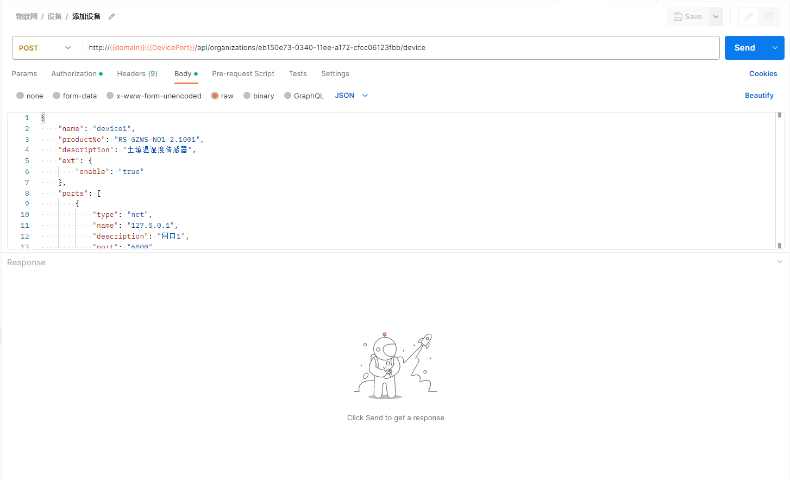

## 添加设备

- **参数列表**

    | 项目   | 内容                   | 描述              |
    |--------|------------------------|-------------------|
    | 服务器 | iot.lecsofts.com:8000  |                   |
    | 接口   | /api/organizations/{orgId}/devices |                   |
    | 方法   | POST                   |                   |
    | Token  | Bearer Token           | 用户登录返回token |
    | 请求   | JSON                   | 参看下图          |
    | 响应   | JSON                   | 参看下图          |

  
- **postman操作**
  
    

## 删除设备

- **参数列表**

    | 项目   | 内容                              | 描述              |
    |--------|-----------------------------------|-------------------|
    | 服务器 | iot.lecsofts.com:8000             |                   |
    | 接口   | /api/organizations/{orgId}/devices/{deviceId} |                   |
    | 方法   | DELETE                              |                   |
    | Token  | Bearer Token                      | 用户登录返回token |
    | 请求   | 无                                |                   |
    | 响应   | true                              | 参看下图          |

  
- **postman操作**
  
    

## 更新设备

- **参数列表**

    | 项目   | 内容                              | 描述              |
    |--------|-----------------------------------|-------------------|
    | 服务器 | iot.lecsofts.com:8000             |                   |
    | 接口   | /api/organizations/{orgId}/devices/{deviceId} |                   |
    | 方法   | PUT                              |                   |
    | Token  | Bearer Token                      | 用户登录返回token |
    | 请求   | 无                                |                   |
    | 响应   | JSON                              | 参看下图          |

  
- **postman操作**
  
    

## 查询单个设备

- **参数列表**

    | 项目   | 内容                       | 描述              |
    |--------|----------------------------|-------------------|
    | 服务器 | iot.lecsofts.com:8000      |                   |
    | 接口   | /api/organizations/{orgId}/devices/{deviceId} |                   |
    | 方法   | GET                        |                   |
    | Token  | Bearer Token               | 用户登录返回token |
    | 请求   | 无                         |                   |
    | 响应   | JSON                       | 参看下图          |

  
- **postman操作**
  
    

## 查询所有设备

- **参数列表**

    | 项目   | 内容                                  | 描述              |
    |--------|---------------------------------------|-------------------|
    | 服务器 | iot.lecsofts.com:8000                 |                   |
    | 接口   | /api/organizations/{orgId}/devices?page=0&pageSize=20 |                   |
    | 方法   | GET                                   |                   |
    | Token  | Bearer Token                          | 用户登录返回token |
    | 请求   | 分页数据                              | 参看下图          |
    | 响应   | JSON                                  | 参看下图          |

  
- **postman操作**
  
    
