## 用户登录

- **参数列表**

    | 项目   | 内容                  | 描述                             |
    |--------|-----------------------|----------------------------------|
    | 服务器 | iot.lecsofts.com:8000 |                                  |
    | 接口   | /api/auth/login       |                                  |
    | 方法   | POST                  |                                  |
    | Token  | 无                    |                                  |
    | 请求   | JSON                  | 包含是登录用户名和密码，参看下图 |
    | 响应   | JSON                  | 包含是登录用户名和密码，参看下图 |

  
- **postman操作**
  
    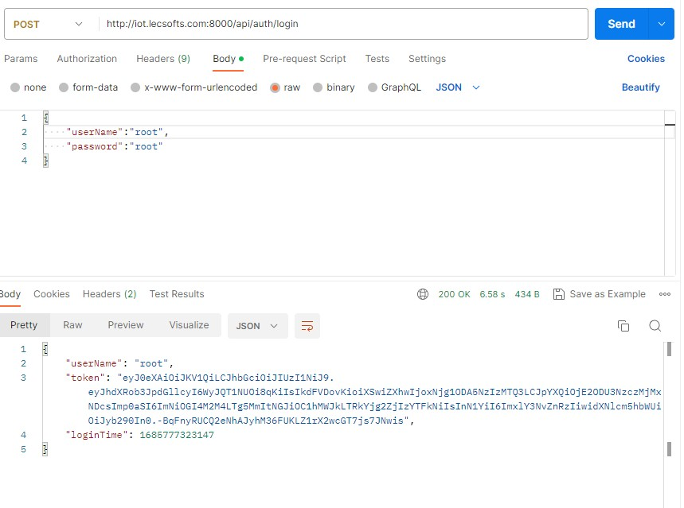

## 用户注销

- **参数列表**

    | 项目   | 内容                  | 描述              |
    |--------|-----------------------|-------------------|
    | 服务器 | iot.lecsofts.com:8000 |                   |
    | 接口   | /api/auth/logout      |                   |
    | 方法   | POST                  |                   |
    | Token  | Bearer Token          | 用户登录返回token |
    | 请求   | 无                    |                   |
    | 响应   | 无                    |                   |

  
- **postman操作**
  
    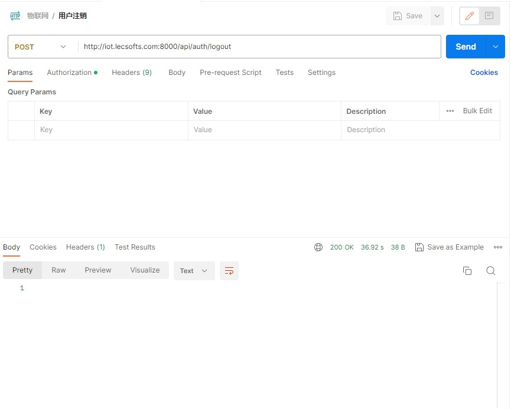

## 添加组织单位

- **参数列表**

    | 项目   | 内容                   | 描述              |
    |--------|------------------------|-------------------|
    | 服务器 | iot.lecsofts.com:8000  |                   |
    | 接口   | /api/organizations/add |                   |
    | 方法   | POST                   |                   |
    | Token  | Bearer Token           | 用户登录返回token |
    | 请求   | JSON                   | 参看下图          |
    | 响应   | JSON                   | 参看下图          |

  
- **postman操作**
  
    

## 删除组织单位

- **参数列表**

    | 项目   | 内容                              | 描述              |
    |--------|-----------------------------------|-------------------|
    | 服务器 | iot.lecsofts.com:8000             |                   |
    | 接口   | /api/organizations/{orgId}/delete |                   |
    | 方法   | POST                              |                   |
    | Token  | Bearer Token                      | 用户登录返回token |
    | 请求   | 无                                |                   |
    | 响应   | true                              | 参看下图          |

  
- **postman操作**
  
    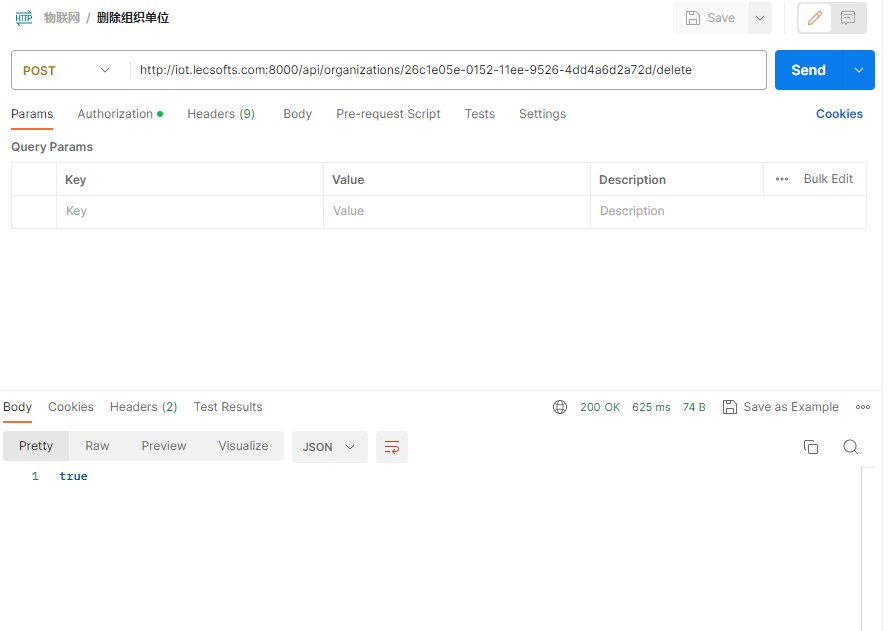

## 更新组织单位

- **参数列表**

    | 项目   | 内容                              | 描述              |
    |--------|-----------------------------------|-------------------|
    | 服务器 | iot.lecsofts.com:8000             |                   |
    | 接口   | /api/organizations/{orgId} |                   |
    | 方法   | PUT                              |                   |
    | Token  | Bearer Token                      | 用户登录返回token |
    | 请求   | 无                                |                   |
    | 响应   | JSON                              | 参看下图          |

  
- **postman操作**
  
    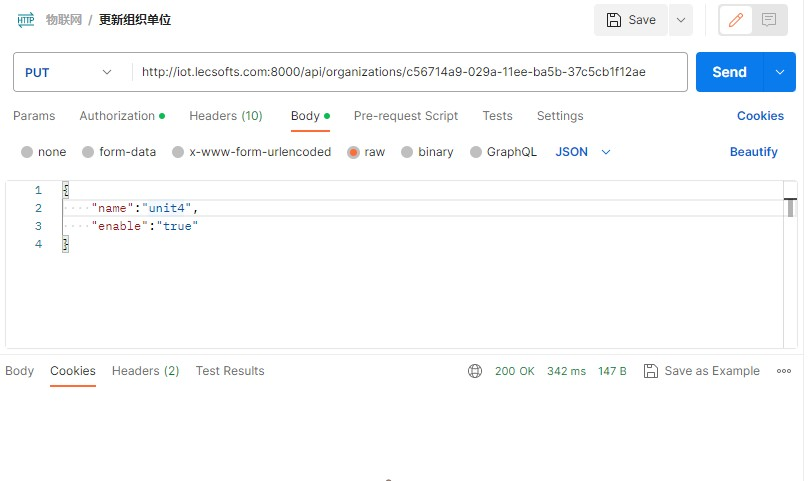

## 查询单个组织单位

- **参数列表**

    | 项目   | 内容                       | 描述              |
    |--------|----------------------------|-------------------|
    | 服务器 | iot.lecsofts.com:8000      |                   |
    | 接口   | /api/organizations/{orgId} |                   |
    | 方法   | GET                        |                   |
    | Token  | Bearer Token               | 用户登录返回token |
    | 请求   | 无                         |                   |
    | 响应   | JSON                       | 参看下图          |

  
- **postman操作**
  
    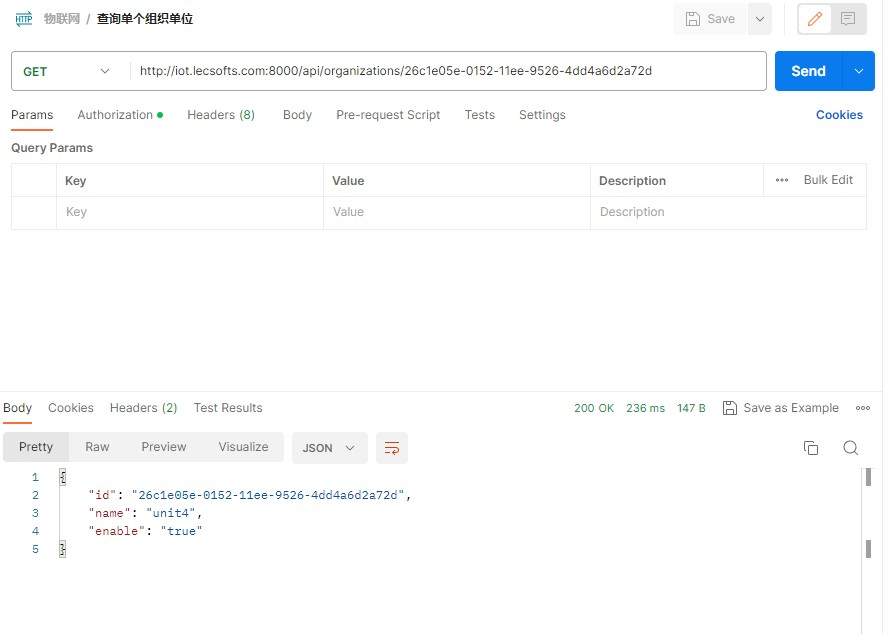

## 查询所有组织单位

- **参数列表**

    | 项目   | 内容                                  | 描述              |
    |--------|---------------------------------------|-------------------|
    | 服务器 | iot.lecsofts.com:8000                 |                   |
    | 接口   | /api/organizations?page=0&pageSize=20 |                   |
    | 方法   | GET                                   |                   |
    | Token  | Bearer Token                          | 用户登录返回token |
    | 请求   | 分页数据                              | 参看下图          |
    | 响应   | JSON                                  | 参看下图          |

  
- **postman操作**
  
    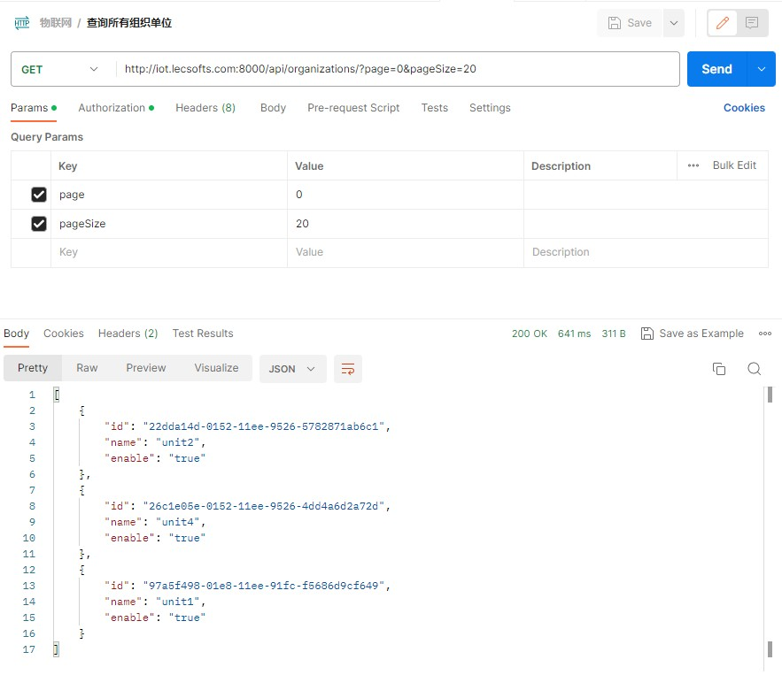

## 添加用户

- **参数列表**

    | 项目   | 内容                                 | 描述              |
    |--------|--------------------------------------|-------------------|
    | 服务器 | iot.lecsofts.com:8000                |                   |
    | 接口   | /api/organizations/{orgId}/users/add |                   |
    | 方法   | POST                                 |                   |
    | Token  | Bearer Token                         | 用户登录返回token |
    | 请求   | JSON                                 | 参看下图          |
    | 响应   | JSON                                 | 参看下图          |

  
- **postman操作**
  
    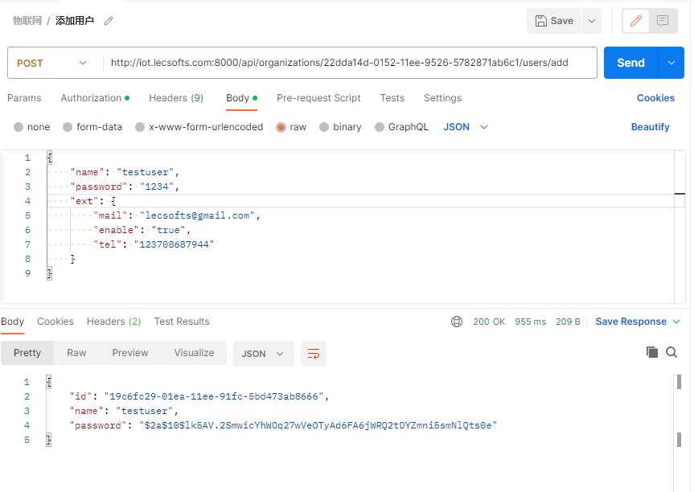

## 删除用户
    禁止用户，物理不删除

- **参数列表**

    | 项目   | 内容                                             | 描述              |
    |--------|--------------------------------------------------|-------------------|
    | 服务器 | iot.lecsofts.com:8000                            |                   |
    | 接口   | /api/organizations/{orgId}/users/{userId}/delete |                   |
    | 方法   | POST                                             |                   |
    | Token  | Bearer Token                                     | 用户登录返回token |
    | 请求   | 无                                               | 参看下图          |
    | 响应   | JSON                                             | 参看下图          |

  
- **postman操作**
  
    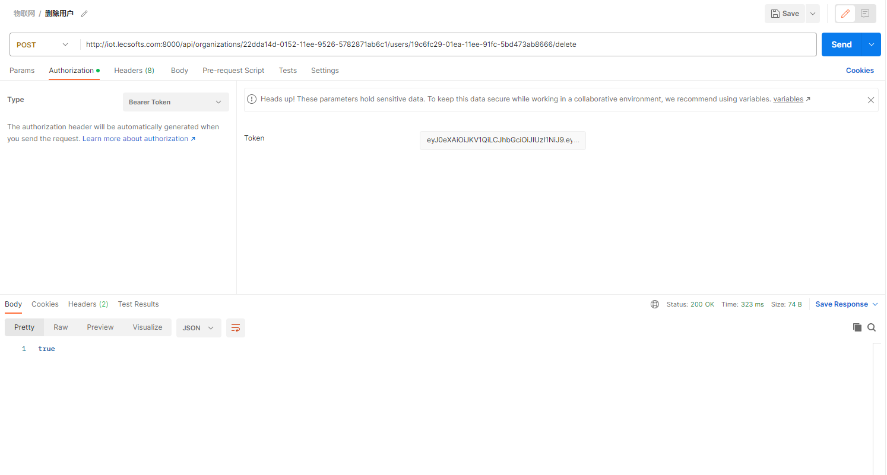

## 更新用户

- **参数列表**

    | 项目   | 内容                                             | 描述              |
    |--------|--------------------------------------------------|-------------------|
    | 服务器 | iot.lecsofts.com:8000                            |                   |
    | 接口   | /api/organizations/{orgId}/users/{userId} |                   |
    | 方法   | PUT                                             |                   |
    | Token  | Bearer Token                                     | 用户登录返回token |
    | 请求   | JSON                                             | 参看下图          |
    | 响应   | JSON                                             | 参看下图          |

  
- **postman操作**
  
    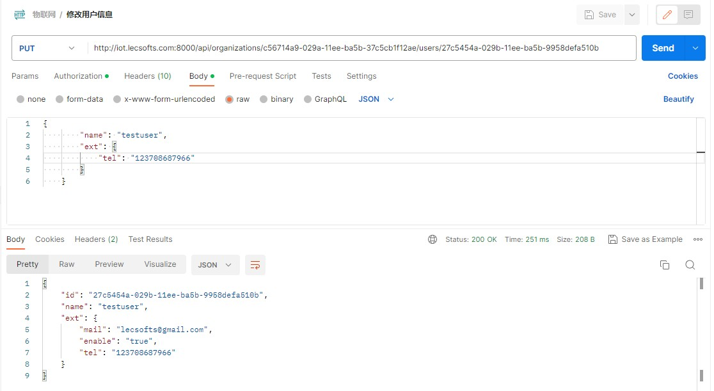

## 查询所有用户

- **参数列表**

    | 项目   | 内容                                                | 描述              |
    |--------|-----------------------------------------------------|-------------------|
    | 服务器 | iot.lecsofts.com:8000                               |                   |
    | 接口   | /api/organizations/{orgId}/users?page=0&pageSize=20 |                   |
    | 方法   | GET                                                 |                   |
    | Token  | Bearer Token                                        | 用户登录返回token |
    | 请求   | 分页数据                                            | 参看下图          |
    | 响应   | JSON                                                | 参看下图          |

  
- **postman操作**
  
    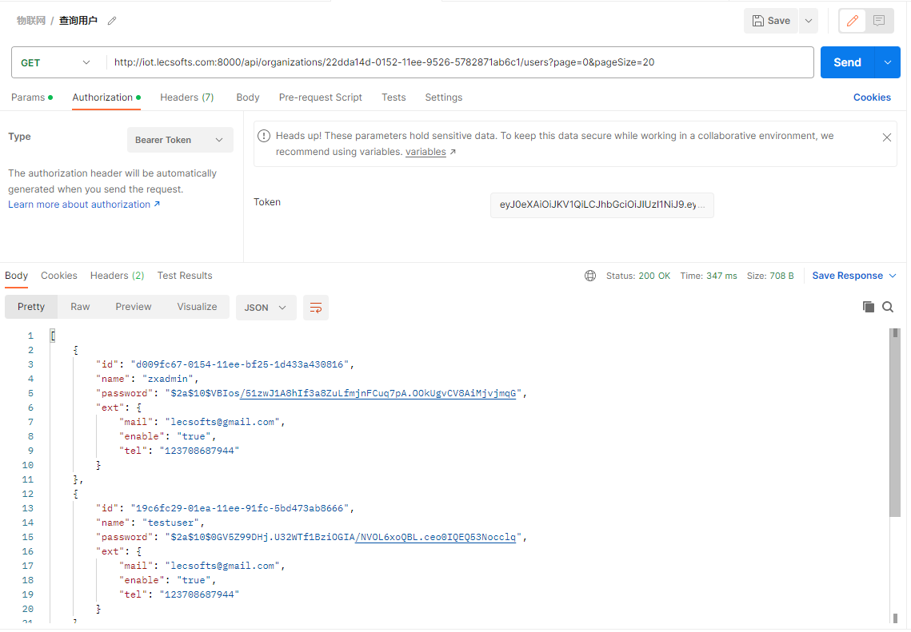

## 查询单个用户

- **参数列表**

    | 项目   | 内容                                      | 描述              |
    |--------|-------------------------------------------|-------------------|
    | 服务器 | iot.lecsofts.com:8000                     |                   |
    | 接口   | /api/organizations/{orgId}/users/{userId} |                   |
    | 方法   | GET                                       |                   |
    | Token  | Bearer Token                              | 用户登录返回token |
    | 请求   | 无                                        | 参看下图          |
    | 响应   | JSON                                      | 参看下图          |

  
- **postman操作**
  
    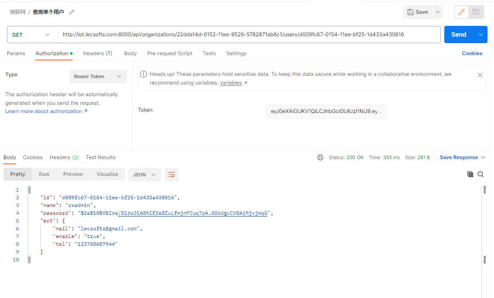